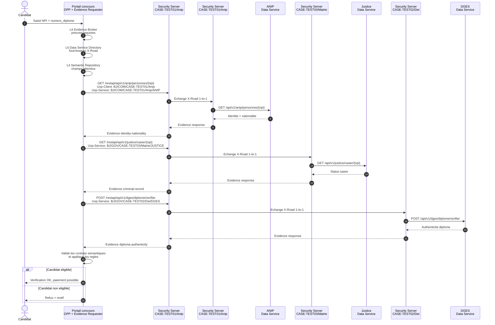

# MVP X-Road - Once-only

Ce projet simule un parcours de candidature a un concours national avec le principe `only ask once`.

Le candidat fournit uniquement son `NPI` et son `numero_diplome` au portail. Le portail ne redemande pas le casier judiciaire, la nationalite ou les informations de diplome: ces preuves sont recuperees directement depuis les registres sources via des noeuds X-Road simules.

## Services metiers

| Service | Role | Port local |
| --- | --- | --- |
| `system-a-portal` | Portail concours, Evidence Requester OOTS-lite, inscription, paiement, convocation, logs UI | `3000` |
| `system-b-anip` | Registre identite et nationalite | `3001` |
| `system-c-justice` | Registre casier judiciaire | `3002` |
| `system-d-dges` | Registre diplomes | `3003` |

Flux metier:

1. Le candidat saisit `NPI` + `numero_diplome`.
2. Le portail charge son plan de preuves OOTS-lite.
3. Le portail appelle ANIP via X-Road pour l'identite et la nationalite.
4. Le portail appelle Justice via X-Road pour le casier.
5. Le portail appelle DGES via X-Road pour le diplome.
6. Le portail applique les regles de la procedure, puis lance paiement et convocation si le candidat est eligible.

## Mode local existant

Le mode local direct reste disponible:

```powershell
npm run start:all
```

Interface:

```text
https://localhost:3000
```

Dans ce mode, les appels inter-systemes utilisent les certificats mTLS deja presents dans chaque dossier `certs`.

## Mode APIs only en containers derriere Nginx

Le fichier `docker-compose.apis-only.yml` lance le portail et les trois APIs fournisseurs (`ANIP`, `Justice`, `DGES`) derriere un Nginx unique. Il ne lance ni Central Server, ni Security Server, ni proxy X-Road simule.

Demarrage:

```powershell
npm run compose:apis
```

Arret:

```powershell
npm run compose:apis:down
```

URLs locales:

```text
Frontend portail: http://localhost:38080
Gateway APIs:      http://localhost:38000
```

Routes exposees:

| API | URL hote | Backend interne |
| --- | --- |
| Frontend portail | `http://localhost:38080/` | `system-a-portal:3000` |
| API Portail | `http://localhost:38000/api/portal/...` | `system-a-portal:3000` |
| API ANIP | `http://localhost:38000/api/anip/...` | `system-b-anip:3001` |
| API Justice | `http://localhost:38000/api/justice/...` | `system-c-justice:3002` |
| API DGES | `http://localhost:38000/api/dges/...` | `system-d-dges:3003` |

Dans ce mode, les providers tournent en HTTP interne avec `TRUST_XROAD=true`; l'identite systeme reste portee par le header `X-Road-Client`, sans controle ACL dans l'API. L'objectif est de publier les APIs backend sur un seul domaine, puis de les ajouter comme REST APIs dans des Security Servers X-Road distants. Le portail est expose a la racine via le Nginx frontend; pour tester un parcours complet via X-Road, configure `PORTAL_XROAD_BASE_URL` vers le Security Server client du portail et `PORTAL_XROAD_CLIENT` avec le subsystem demandeur.

Variables utiles pour le portail demandeur:

```env
PORTAL_XROAD_BASE_URL=https://10.71.2.17
PORTAL_XROAD_CLIENT=BJ/COM/CASE-TEST01/Anip
PORTAL_XROAD_PROTOCOL=uxp
PORTAL_XROAD_TLS_CERT_PATH=/app/certs/client-cert.pem
PORTAL_XROAD_TLS_KEY_PATH=/app/certs/client-key.pem
```

Sur le domaine cible `cra-case.asin.bj`, le routage attendu est:

```text
http://cra-case.asin.bj/       -> frontend portail
http://cra-case.asin.bj/api/... -> APIs backend
```

URLs typiques a declarer dans les Security Servers distants:

```text
http://<domaine>:38000/api/portal
http://<domaine>:38000/api/anip
http://<domaine>:38000/api/justice
http://<domaine>:38000/api/dges
```

Tests rapides:

```powershell
curl.exe -sS "http://localhost:38080/health"
curl.exe -sS "http://localhost:38000/api/health"

curl.exe -sS "http://localhost:38080/api/portal/api/v1/inscriptions"

curl.exe -sS "http://localhost:38000/api/anip/api/v1/anip/personnes/11111111111111" `
  -H "X-Road-Client: BJ/COM/CASE-TEST01/Anip"

curl.exe -sS "http://localhost:38000/api/justice/api/v1/justice/casier/11111111111111" `
  -H "X-Road-Client: BJ/COM/CASE-TEST01/Anip"

curl.exe -sS -X POST "http://localhost:38000/api/dges/api/v1/dges/diplome/verifier" `
  -H "Content-Type: application/json" `
  -H "X-Road-Client: BJ/COM/CASE-TEST01/Anip" `
  -d '{ "npi": "11111111111111", "numero_diplome": "DIP-LIC-2024-001" }'
```

## Mode X-Road simule en containers

Le fichier `docker-compose.xroad-sim.yml` ajoute un noeud X-Road simule devant chaque service:

| Noeud X-Road | Membre X-Road | Backend |
| --- | --- | --- |
| `xroad-portal` | `BJ/GOV/PORTAL/CONCOURS` | `system-a-portal` |
| `xroad-anip` | `BJ/GOV/ANIP/REGISTRY` | `system-b-anip` |
| `xroad-justice` | `BJ/GOV/JUSTICE/CASIER` | `system-c-justice` |
| `xroad-dges` | `BJ/GOV/DGES/DIPLOMES` | `system-d-dges` |

Demarrage:

```powershell
docker compose -f docker-compose.xroad-sim.yml up --build
```

Interface:

```text
https://localhost:3000
```

Proxy X-Road expose sur l'hote:

```text
http://localhost:8080
```

Exemple d'appel X-Road REST direct vers ANIP:

```powershell
Invoke-RestMethod `
  -Method Post `
  -Uri "http://localhost:8080/r1/BJ/GOV/ANIP/REGISTRY/anip/api/v1/concours/verifier" `
  -Headers @{ "X-Road-Client" = "BJ/GOV/PORTAL/CONCOURS" } `
  -ContentType "application/json" `
  -Body '{ "npi": "11111111111111", "numero_diplome": "DIP-LIC-2024-001" }'
```

Le proxy valide les ACL dans `xroad-proxy/config.json`, transmet les headers `X-Road-Client`, `X-Road-Service`, `X-Road-Id`, `X-Road-Request-Id`, et ajoute `X-Road-Request-Hash` a la reponse.

## Mapping X-Road du MVP

| Client | Service autorise |
| --- | --- |
| `BJ/COM/CASE-TEST01/Anip` | `BJ/COM/CASE-TEST01/Anip/ANIP` |
| `BJ/COM/CASE-TEST01/Anip` | `BJ/GOV/CASE-TEST03/Mairie/JUSTICE` |
| `BJ/COM/CASE-TEST01/Anip` | `BJ/GOV/CASE-TEST02/Dei/DGES` |

Dans le design OOTS-lite retenu, le portail est l'Evidence Requester de la procedure concours. Il a donc les droits d'appel vers les trois fournisseurs de preuves. ANIP n'agrege pas Justice et DGES dans ce mode simplifie.

Avec UXP 1.24, l'appel REST depuis le portail vers son Security Server ne met pas l'identifiant service dans l'URL. Le format est:

```text
<METHOD> http://<security-server>/restapi/<rest-api-path>
Uxp-Client:  BJ/COM/CASE-TEST01/Anip
Uxp-Service: BJ/COM/CASE-TEST01/Anip/ANIP
```

Le format `/r1/{serviceId}/...` et le header `X-Road-Client` correspondent au protocole REST X-Road officiel, pas au format REST UXP 1.24 utilise par cette plateforme.

Si le Security Server client est configure en `HTTPS`, il exige aussi un certificat TLS client de l'information system. Dans l'UI UXP du subsystem demandeur, ajouter `system-a-portal/certs/client-cert.pem` dans `Information Systems Internal TLS Certificates`. Le portail utilise la cle associee via `PORTAL_XROAD_TLS_KEY_PATH`.

## Pattern retenu

Le pattern cible est:

```text
Application consommatrice
  -> Security Server consommateur
  -> Security Server fournisseur
  -> Application fournisseur
```

Les donnees restent dans les registres sources. X-Road porte l'identite systeme, l'autorisation, le routage, la signature/logging et l'auditabilite. Le portail garde uniquement les donnees necessaires a son propre processus: inscription, paiement et convocation.

## Reproduction OOTS-lite

La reproduction reste volontairement legere. Le portail contient trois petits catalogues dans `system-a-portal/oots-lite`:

| Catalogue | Role OOTS approxime | Fichier |
| --- | --- | --- |
| Evidence Broker | Determine les preuves requises par procedure et les regles de decision | `evidence-broker.json` |
| Data Service Directory | Associe chaque type de preuve a un fournisseur X-Road et a une operation REST | `data-service-directory.json` |
| Semantic Repository | Liste les champs attendus en sortie par type de preuve | `semantic-repository.json` |

En mode container X-Road, le portail execute ces etapes:

```text
1. Lire la procedure concours-bourses-master-2026 dans Evidence Broker
2. Resoudre les preuves requises: identity-nationality, criminal-record, diploma-authenticity
3. Resoudre les fournisseurs via Data Service Directory
4. Appeler chaque fournisseur via `/restapi/{rest-api-path}` avec `Uxp-Client` et `Uxp-Service`
5. Verifier les champs de reponse attendus via Semantic Repository
6. Appliquer les regles de decision
7. Produire la reponse finale pour l'inscription
```

Cette structure reproduit les roles techniques OOTS utiles sans ajouter eDelivery, AS4, preview space, redirect ou orchestration centrale. Chaque appel reste un echange X-Road 1-to-1.

Le `NPI` n'est pas repete comme champ de preuve. Il reste le sujet de la requete et apparait dans l'URL ou le corps d'appel, par exemple `/personnes/{npi}` ou `{ "npi": "..." }`. Les preuves retournent seulement les attributs utiles a la decision: nom, prenoms, nationalite, statut du casier, authenticite du diplome.

Sequence principale:



## Alignement OOTS

Le MVP peut etre lu comme une version nationale simplifiee du pattern OOTS.

| OOTS | MVP |
| --- | --- |
| Online Procedure Portal | `system-a-portal` |
| Data Service | `system-b-anip`, `system-c-justice`, `system-d-dges` |
| Data Service Directory | `system-a-portal/oots-lite/data-service-directory.json`, puis catalogue de services dans X-Road reel |
| Evidence Broker | `system-a-portal/oots-lite/evidence-broker.json` |
| Semantic Repository | `system-a-portal/oots-lite/semantic-repository.json`, puis schemas/OpenAPI par type de preuve |
| eDelivery Access Point | Noeud d'echange national; X-Road pour le MVP, eDelivery/AS4 pour une compatibilite OOTS transfrontaliere |
| Preview Space | A ajouter si l'usager doit previsualiser explicitement les preuves avant soumission |
| eID/eIDAS | Hors scope du MVP; actuellement remplace par la saisie NPI |

Les 7 etapes OOTS se traduisent ainsi:

1. `Authenticate`: le MVP utilise le NPI; une version cible utiliserait eID/eIDAS ou une identite nationale forte.
2. `Locate evidence`: le portail resout les preuves requises via `evidence-broker.json`.
3. `Evidence request`: le portail appelle ANIP, Justice et DGES via X-Road.
4. `Redirect`: non implemente; utile si le fournisseur doit reprendre la main pour consentement ou authentification.
5. `Preview`: non implemente; a ajouter pour afficher les preuves avant usage.
6. `Evidence response`: chaque registre retourne sa preuve; le portail consolide la decision de procedure.
7. `Submit`: le portail finalise candidature, paiement et convocation.

Architecture cible:

```text
Procedure Portal
  -> Evidence Broker / Data Service Directory
  -> National exchange layer: X-Road
  -> Data Services: ANIP, Justice, DGES
  -> Evidence responses
  -> Preview / consent
  -> Submit procedure
```

Decision pragmatique pour ce use case: X-Road reste la couche nationale de confiance et de routage entre administrations. Les concepts OOTS servent de modele pour nommer les roles, structurer les preuves, prevoir le catalogue de services et preparer une future passerelle transfrontaliere eDelivery/OOTS.

## Passage vers X-Road reel

La simulation actuelle ne remplace pas X-Road. Elle sert a stabiliser le use case, les services, les identifiants, les ACL et les chemins REST.

Pour passer a X-Road reel:

1. Remplacer `xroad-proxy` par des Security Servers X-Road officiels.
2. Enregistrer les membres et sous-systemes dans un Central Server.
3. Publier chaque API REST comme service X-Road avec son OpenAPI si disponible.
4. Configurer les droits d'acces service par service.
5. Supprimer `TRUST_XROAD=true` et faire confiance uniquement au canal local Security Server -> backend.
6. Conserver le contrat applicatif cote demandeur: le portail appelle son Security Server UXP avec `/restapi/{rest-api-path}`, `Uxp-Client` et `Uxp-Service`. Les APIs providers ne codent pas les clients autorises; les ACL restent dans les Security Servers.

Sources utiles:

- OOTS Architecture: https://ec.europa.eu/digital-building-blocks/sites/spaces/OOTS/pages/604504755/Architecture
- OOTS Catalogue of reusable services: https://ec.europa.eu/digital-building-blocks/sites/spaces/OOTS/pages/852426825/Catalogue+of+reusable+services
- OOTS TDD Home: https://ec.europa.eu/digital-building-blocks/sites/spaces/TDD/pages/605325061/OOTS+Technical+Design+Documents+Home
- OOTS High Level Architecture v1.2.1: https://ec.europa.eu/digital-building-blocks/sites/spaces/TDD/pages/900012709/1.+Once-Only+Technical+System+High+Level+Architecture+v1.2.1+April+2025
- X-Road Once-only Principle: https://x-road.global/once-only-principle
- X-Road Data Exchange: https://x-road.global/data-exchange
- X-Road Message Protocol for REST: https://docs.x-road.global/Protocols/pr-rest_x-road_message_protocol_for_rest.html
- X-Road Security Server Sidecar: https://docs.x-road.global/Sidecar/security_server_sidecar_user_guide.html

## Mode X-Road officiel en containers

Le fichier `docker-compose.xroad-official.yml` lance les composants X-Road officiels:

| Composant | Image | URL locale |
| --- | --- | --- |
| Central Server | `niis/xroad-central-server:noble-7.8.2` | `https://localhost:4000` |
| Security Server Portail | `niis/xroad-security-server-sidecar:7.8.2` | `https://localhost:4100` |
| Security Server ANIP | `niis/xroad-security-server-sidecar:7.8.2` | `https://localhost:4101` |
| Security Server Justice | `niis/xroad-security-server-sidecar:7.8.2` | `https://localhost:4102` |
| Security Server DGES | `niis/xroad-security-server-sidecar:7.8.2` | `https://localhost:4103` |

Demarrage:

```powershell
npm run compose:xroad:official
```

Equivalent Linux/macOS:

```bash
npm run compose:xroad:official
```

Les UI natives X-Road sont disponibles apres l'initialisation Java des conteneurs, ce qui peut prendre quelques minutes sur Docker Desktop:

```text
https://localhost:4000  Central Server UI
https://localhost:4100  Security Server Portail UI
https://localhost:4101  Security Server ANIP UI
https://localhost:4102  Security Server Justice UI
https://localhost:4103  Security Server DGES UI
```

Il faut accepter le certificat autosigne dans le navigateur. Si une page ne s'affiche pas encore, verifier que le port repond:

```powershell
Invoke-WebRequest -Uri https://localhost:4000 -SkipCertificateCheck -UseBasicParsing
Invoke-WebRequest -Uri https://localhost:4100 -SkipCertificateCheck -UseBasicParsing
```

Identifiants par defaut des UI natives X-Road:

```text
Compte UI admin: xrd
Mot de passe UI: secret
PIN du software token: Str0ng-Pin!2026
```

Ces identifiants valent pour le Central Server et les Security Servers de lab. Le PIN sert a initialiser/deverrouiller le token logiciel X-Road, ce n'est pas le mot de passe de connexion UI.

Ports utiles:

| Service | Port host |
| --- | --- |
| Central Server UI/API | `4000`, `4001`, `4002` |
| TEST-CA / TSA / OCSP du Central Server | `8888`, `8899`, `80` |
| Portail X-Road consumer HTTP | `8180` |
| ANIP X-Road consumer HTTP | `8181` |
| Justice X-Road consumer HTTP | `8182` |
| DGES X-Road consumer HTTP | `8183` |
| Health Security Servers | `5580`, `5581`, `5582`, `5583` |

Cette stack demarre les vrais conteneurs X-Road. Pour que le test marche vraiment, les Security Servers doivent aussi etre enregistres cote Central Server, avoir leurs certificats et exposer les services REST avec les ACL attendues. Le script complet fait ce setup de bout en bout:

```powershell
.\scripts\bootstrap-xroad-official-full.ps1
```

Equivalent Linux/macOS:

```bash
chmod +x scripts/bootstrap-xroad-official-full.sh
./scripts/bootstrap-xroad-official-full.sh
```

Le script complet:

1. Initialiser le Central Server.
2. Creer l'instance X-Road `BJ`.
3. Creer les member classes, par exemple `GOV`.
4. Enregistrer les membres:
   - `BJ/GOV/PORTAL`
   - `BJ/GOV/ANIP`
   - `BJ/GOV/JUSTICE`
   - `BJ/GOV/DGES`
5. Enregistrer les sous-systemes:
   - `BJ/GOV/PORTAL/CONCOURS`
   - `BJ/GOV/ANIP/REGISTRY`
   - `BJ/GOV/JUSTICE/CASIER`
   - `BJ/GOV/DGES/DIPLOMES`
6. Initialiser chaque Security Server avec son token logiciel.
7. Generer les certificats de signature et d'authentification.
8. Faire approuver les certificats et les registrations cote Central Server.
9. Publier les services REST:
   - ANIP: backend `http://system-b-anip:3001`, service code `anip`
   - Justice: backend `http://system-c-justice:3002`, service code `justice`
   - DGES: backend `http://system-d-dges:3003`, service code `dges`
10. Configurer les droits d'acces:
   - `PORTAL/CONCOURS` -> `ANIP/REGISTRY/anip`
   - `PORTAL/CONCOURS` -> `JUSTICE/CASIER/justice`
   - `PORTAL/CONCOURS` -> `DGES/DIPLOMES/dges`

Une fois ces etapes faites, les applications doivent pointer vers les Security Servers officiels. Les variables sont deja prevues dans le compose:

```yaml
PORTAL_XROAD_BASE_URL=https://10.71.2.17
PORTAL_XROAD_CLIENT=BJ/COM/CASE-TEST01/Anip
PORTAL_XROAD_PROTOCOL=uxp
PORTAL_XROAD_TLS_CERT_PATH=/app/certs/client-cert.pem
PORTAL_XROAD_TLS_KEY_PATH=/app/certs/client-key.pem
```

Correction de l'erreur `configuration-anchor.xml`:

```powershell
.\scripts\bootstrap-xroad-official-anchor.ps1
```

Equivalent Linux/macOS:

```bash
chmod +x scripts/bootstrap-xroad-official-anchor.sh
./scripts/bootstrap-xroad-official-anchor.sh
```

Le script initialise le Central Server de lab, cree ou reactive les droits API necessaires, cree les cles de signature des configurations `INTERNAL` et `EXTERNAL`, telecharge l'ancre de configuration interne et la copie dans les Security Servers. Il corrige les symptomes vus dans les logs: `ANCHOR_FILE_NOT_FOUND`, `GlobalConf ... is empty` et `Signing of external configuration failed - active key missing`.

Ce script d'ancre seul ne suffit pas pour faire passer un appel X-Road applicatif: il prepare la configuration globale, mais ne publie pas les Security Servers, les clients, les certificats et les services. Pour un test complet, utiliser `bootstrap-xroad-official-full.ps1`.

Pour un demo rapide et reproductible sans configuration X-Road manuelle, utiliser `docker-compose.xroad-sim.yml`. Pour valider les vrais ecrans, certificats, registrations, ACL et logs X-Road, utiliser `docker-compose.xroad-official.yml`.
